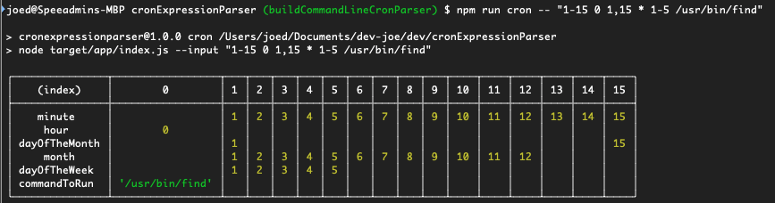

# Cron Expression Parser

# prerequisites

- Install Node v12+ (Currently running `12.14.0`) (Recommend using a node version manager: http://npm.github.io/installation-setup-docs/installing/using-a-node-version-manager.html)
- Install app run `npm i` from the root directory
- Build the app run `npm run build` from the root directory
- Information on cron patterns can found here: http://crontab.org/
- Basic cron expressions
 * any value
 , value list separator (e.g. 1,2,5)
 - range of values (e.g. 15-30)
 / step values (e.g. */5)
 Any combination of these (e.g. 5-10,20-25,*/15)
- Running the cron parser `npm run cron -- "1-15 0 1,15 * 1-5 /usr/bin/find"`
- Example;
   - 
 - Lots of examples located here `./test`

